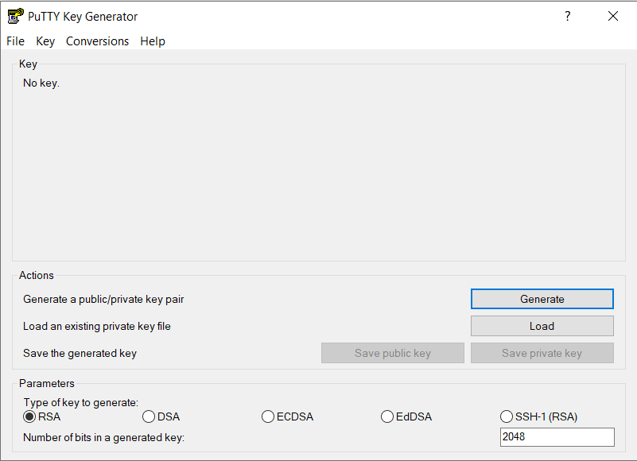
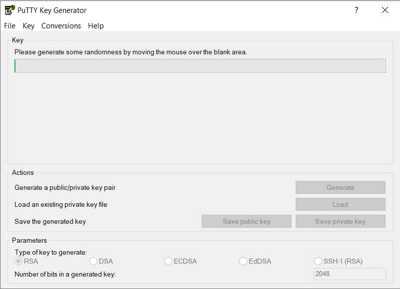
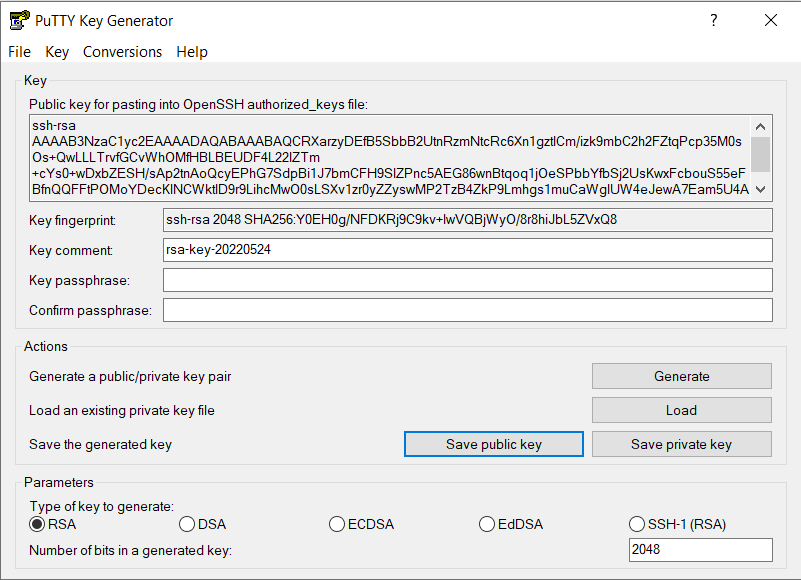
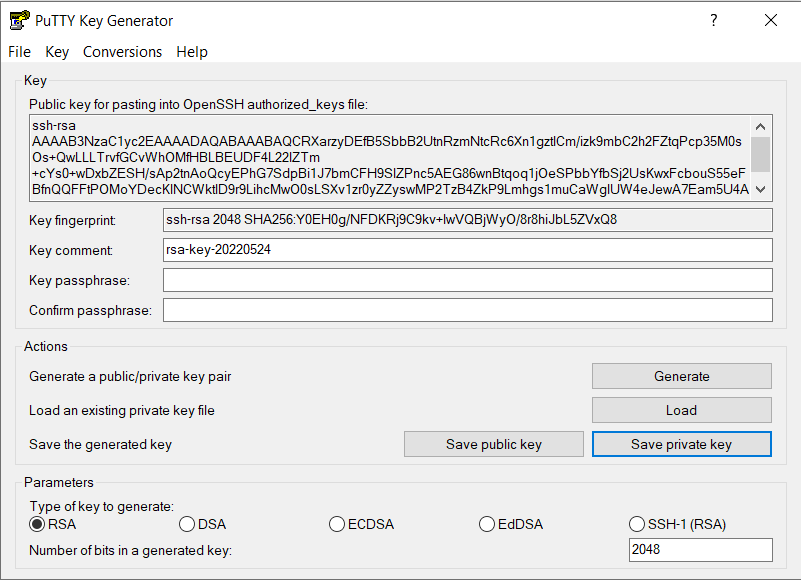
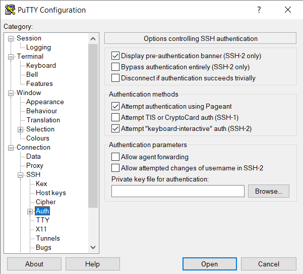
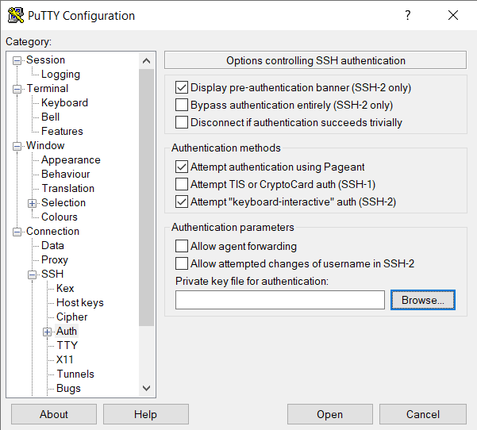
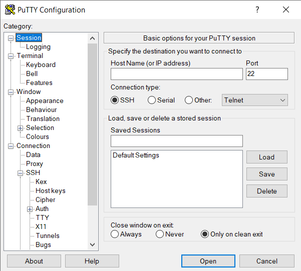
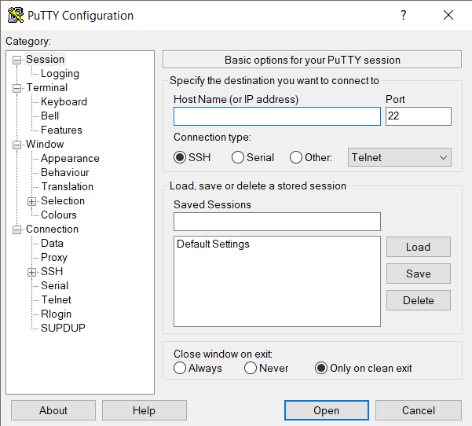

# Uwierzytelnianie klienta SSH za pomocą kluczy prywatnych

## Konfiguracja serwera

Pierwszym krokiem będzie zainstalowanie serwera SSH. 

RHEL/Fedora: 
```bash
dnf install openssh-server
```

Ubuntu:
```bash
apt install openssh-server
```

Na Windowsie należy wejść w **Ustawienia**, wybrać **Aplikacje > Aplikacje i funkcje**, a następnie  **Funkcje opcjonalne**.
Następnie wybierz opcję **Dodaj funkcję**, wtedy znajdź **OpenSSH Server** i kliknij **Zainstaluj**.

Kolejnym krokiem będzie uruchomienie serwera i skonfigurowanie tak, aby uruchamiał się wraz ze startem systemu.
Na Linuxie wystarczą komendy:
```bash
systemctl start openssh-server
systemctl enable openssh-server
```

W przypadku korzystania z Windowsa uruchom **Menedżera zadań**, rozwiń **Usługi**, i kliknij **Otwórz usługi**. Następnie znajdź **OpenSSH Server**, kliknij prawym przyciskiem myszy, i wybierz **Właściwości**.
Typ uruchomienia należy zmienić na **Automatyczny**.

Więcej informacji:
https://docs.microsoft.com/en-us/windows-server/administration/openssh/openssh_install_firstuse

## Generowanie kluczy
### Polecenie ssh-keygen
Do wygenerowania kluczy można skorzystać z polecenia:
```bash
ssh-keygen
```
wybierając wartości domyślne poprzez wciskanie klawisza Enter.

Wygenerowana para kluczy zostanie umieszczony w katalogu `.ssh` w folderze użytkownika, pod nazwami 
```bash
id_rsa
id_rsa.pub
```
gdzie plik z roszerzeniem `.pub` jest kluczem publicznym.

### PuTTY
1. Otwórz program PuTTYgen
2. Kliknij przycisk 'generate'



3. Poruszaj kursorem myszki nad pustym obszarem podpisanym 'Key' w celu wygenerowania pary kluczy



4. Kliknij przycisk 'Save public key', wybierz nazwę i lokalizację pliku, żeby zapisać klucz publiczny lub skopiuj zawartość pola 'Public key for pasting into OpenSSH authorized_keys file'



5. Kliknij przycisk 'Save private key', wybierz passphrase* oraz nazwę i lokalizację pliku, żeby zapisać klucz prywatny



*passphrase jest polem opcjonalnym zapewniającym większe bezpieczneństwo klucza prywatnego poprzez szyfrowanie, ale wymaga podania przy każdym jego użyciu

## Instalacja kluczy dla wybranych klientów usług ssh
#### Instalacja klucza publicznego
1. Sprawdź, czy na serwerze, z którym chcesz się połączyć, w katalogu home znajduje się ukryty katalog '.ssh' z plikiem 'authorized_key' w środku. Jeśli tak, postępuj dalej.

W przeciwnym wypadku wykonaj w katalogu home:
```
mkdir .ssh
cd .ssh
touch authorized_keys
```
2. Przekopiuj klucz publiczny do środka pliku authorized_keys*
*w pliku może się znajdować więcej niż jeden klucz publiczny

Klucz publiczny można przekopiować do środka authorized_keys na kilka sposobów:
1. Ręcznie wprowadzając klucz do pliku
2. Korzystając z komendy scp od strony użytkownika przekopiowując cały plik na stronę serwera
3. Korzystając z komendy 'ssh-copy-id' na systemie Linux
4. Korzystając ze [skryptu-substytutu dla 'ssh-copy-id'](https://gist.github.com/ceilfors/fb6908dc8ac96e8fc983) na systemie Windows
#### Instalacja klucza prywatnego
##### PuTTY
1. Otwórz program PuTTY
2. Z menu po lewej stronie wybierz 'Connection>SSH>Auth'



3. Obok pustego pola 'Private key file for authentication' kliknij przycisk 'Browse' i wybierz klucz prywatny



4. Z menu po lewej stronie wybierz 'Session'



5. W pole 'Host Name (or IP address)' wpisz nazwę lub adres IP serwera z jakim chcesz się połączyć i kliknij przycisk 'Open'



##### Windows SSH
Klucz prywatny zlokalizowany w domyślnym katalogu:
```
ssh user@host
```
Klucz prywatny lokalizowany w innym katalogu:
```
ssh -i <lokalizacja klucza> user@host
```
Gdzie:

user - nazwa użytkownika z jakim się łączymy

host - adres IP serwera z jakim się łączymy


## Bezpieczny transfer plików z wykorzystaniem ssh

SCP (secure copy) to narzędzie pozwalające na bezpieczne kopiowanie plików i katalogów pomiędzy zdalnymi hostami.

Składnia polecenia:
```
scp [OPTION] [user@]SRC_HOST:]file1 [user@]DEST_HOST:]file2
```

Bezpieczne przesłanie pliku z hosta na serwer:
```
scp -i C:\Users\<winuser>\.ssh\id_rsa <ścieżka/nazwa_wysyłanego pliku> <user>@<ip_serwera>:/home/<user>/<nazwa_przeslanego_pliku>
```

lub jeśli klucz został wygenerowany w domyślnym katalogu:
```
scp <ścieżka/nazwa_wysyłanego pliku> <user>@<ip_serwera>:/home/<user>/<nazwa_przeslanego_pliku>
```

Bezpieczne pobranie pliku z serwera:
```
scp -i C:\Users\<winuser>\.ssh\id_rsa <user>@<ip_serwera>:/home/<user>/<ścieżka/nazwa_pobieranego_pliku> <ścieżka/nazwa_pobranego_pliku>
```

lub jeśli klucz został wygenerowany w domyślnym katalogu:
```
scp <user>@<ip_serwera>:/home/<user>/<ścieżka/nazwa_pobieranego_pliku> <ścieżka/nazwa_pobranego_pliku>
```
  
## Dodatkowe uwagi
### Zdejmowanie passphrase z klucza
1. Wykonaj polecenie:
```
  ssh-keygen -p
```
2. Podaj stare passphrase do klucza, nowe passphrase pozostaw jako puste

Przykład użycia:
```
C:\Users\vip>ssh-keygen -p
Enter file in which the key is (C:\Users\<user>/.ssh/id_rsa):
Enter old passphrase:
Key has comment '<user>@DESKTOP-17P39QL'
Enter new passphrase (empty for no passphrase):
Enter same passphrase again:
Your identification has been saved with the new passphrase.
```
